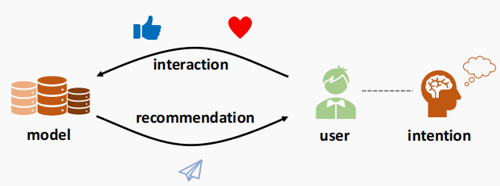
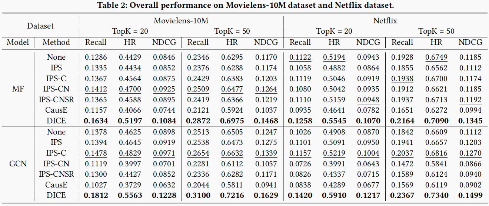
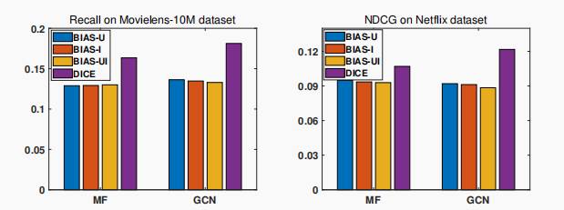
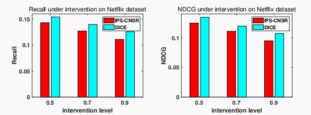
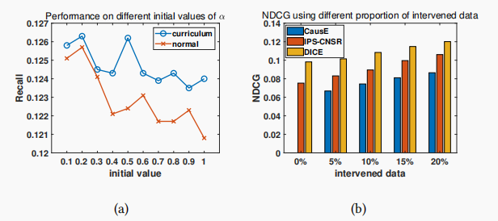

## 通过因果嵌入理清用户的兴趣和推荐盲从性

### 摘要

推荐模型通常是根据观测交互数据进行训练的。然而，观察性交互数据可能是由于用户对流行商品的盲从性，这困扰了用户的真正兴趣。现有的方法通常从消除流行度偏差出发，例如，通过重新加权训练样本或利用一小部分无偏数据。然而，这些方法忽略了用户盲从性的多样性，交互的不同原因被作为统一的表示捆绑在一起，因此当潜在原因发生变化时，不能保证健壮性和可解释性。在本文中，我们提出了DICE，一个通用的框架，学习将兴趣和盲从性在结构上解耦，并且各种主干推荐模型可以顺利地集成。我们根据兴趣和盲从性分配用户和商品单独的嵌入，并通过根据因果推理的碰撞效应获得的特定原因数据进行训练，使每个嵌入只能捕获一个原因。我们提出的方法优于最先进的基线，在两个基于各种主干模型的真实数据集上有了显著的改进。我们进一步证明了学习到的嵌入成功地捕获了期望的原因，并表明DICE保证了推荐的鲁棒性和可解释性。

### 论文分类索引

信息系统$\rightarrow$协同过滤

### 关键词

推荐系统，流行度偏差，因果嵌入

### 1 介绍

近年来，推荐系统取得了巨大的成功，通过从观测交互数据中挖掘用户偏好，为用户提供个性化的内容[36]。然而，观察交互数据显示出很强的流行偏差[12]，这困扰了用户的真正兴趣。用户可能会因为许多其他用户点击了一个商品，例如在电子商务平台上，商品通常会显示他们的销售价值。事实上，这些交互主要是由用户的盲从性驱动的，而不是真正的兴趣。作为决策的一个关键因素，盲从性描述了用户如何倾向于跟随他人。同时，对一件商品的盲从性也因不同用户的不同而不同。为了获取用户独立于盲从性的纯粹兴趣，现有的方法将这个问题跟踪为消除流行偏差，从商品的角度看一个静态和全局的术语，而忽略了用户盲从性的多样性。例如，一个运动爱好者购买一辆高销售价值的自行车，因为他独特的特定特征（如轮胎尺寸或速度容量），而办公室职员可能购买同一辆自行车，只是因为它的高销量。使用统一的人气偏差并不能区分这两个用户的不同盲从性，因为一个商品的人气得分对所有用户都是相同的。因此，理清用户的兴趣和盲从性是提高推荐质量的关键。

在这项工作中，我们从用户的角度采取了一种不同的方法。我们不建议从商品的角度来消除流行偏差，而是将观察到的交互分解为用户方面的两个因素，即兴趣和盲从性，并学习它们的解耦表示。解开这两个因素是具有挑战性的，而且还没有得到很好的探索。具体来说，我们面临着三个关键的挑战。首先，盲从性取决于用户和商品。一个用户的盲从性因商品的不同而不同，而不同用户对一个商品的盲从性也不同。因此，对于现有算法[4]所采用的用户或项的标量偏差项是不够的。其次，学习解耦表示在本质上是困难的，特别是当只有观测交互数据可用时。换句话说，我们只能获得效果，而不是原因，因为对兴趣和盲从性没有标记的地面真实价值。第三，点击交互可以来自于一个或两个感兴趣和盲从性的原因。因此，它需要仔细的设计来聚集和平衡这两个原因。

尽管这是一项具有挑战性的任务，但与只为用户或商品学习统一嵌入的方法相比，学习兴趣和盲从性的解耦表示有两个主要优势：

（1）鲁棒性。真实世界的推荐系统经常使用实时用户交互不断进行训练和更新，形成如图1所示的反馈回路，训练数据和测试数据不是独立的同分布（IID）[13]。对效应（点击）和原因（兴趣和盲从性）的因果建模可以导致更健壮的模型，具有更强的泛化能力，特别是在潜在原因正在改变[41]的非IID情况下。
（2）可解释性。可解释的推荐有利于用户和推荐系统的用户和平台，因为它提高了用户友好性，促进了算法的开发。通过解开潜在的原因，每个推荐得分被分解为兴趣得分和盲从性得分的聚合。因此，根据相应的分数，可以很容易地对这两个原因进行解释。

图1：推荐系统的反馈回路。用户根据用户的意愿与模型进行交互，并利用用户的交互数据对模型进行训练。

图2：非IID环境下的形状识别。一个模型可以从训练数据中的大小或颜色来预测形状，因为矩形是蓝色和大的，三角形是绿色和小的，圆圈是橙色和中等大小的。然而，在非IID的情况下，如在测试数据中，颜色和大小与训练数据不同，因此只有解开潜在因素的模型才能在这个例子中存活下来。

在本文中，我们提出了一个一般的框架来解开兴趣和符合因果嵌入（DICE）。为了捕捉盲从性的多样性，我们建议单独学习盲从性嵌入，这与用户的兴趣无关，这与用户的兴趣无关。我们没有使用简单的标量流行值作为现有的方法，而是开发了特定的方法，以学习兴趣和盲从性的解耦表示。具体来说，我们描述了每个交互数据如何生成的因果模型。基于因果模型，我们基于因果推理[37,38]的碰撞效应，提出了特定原因的特定负抽样策略，并学习兴趣和与特定原因数据的单独嵌入。同时，我们增加了对嵌入之间解耦的直接监督。为了生成同时考虑用户兴趣和盲从性的最终推荐，我们利用多任务学习和课程学习，成功地平衡了这两个原因。

我们在从真实应用程序中收集到的两个大规模基准数据集上评估了所提出的方法。实验结果表明，DICE在召回率和NDCG方面的改进优于最先进的基线，提高了超过15%。为了研究DICE的稳健性，我们通过对盲从性进行干预，提取具有训练数据的非IID的测试数据。我们证明了在非IID的情况下，DICE始终优于基线方法。此外，我们提供了学习嵌入质量的分析结果，这说明了该方法的优越的可解释性。

综上所述，本文的主要贡献如下：

* 据我们所知，这是第一个为推荐系统制定解开用户兴趣和盲从性问题的工作。我们从用户的角度来解决因果推荐问题，并表明在稳健性和可解释性方面，解开这两个因素对于鲁棒性是必不可少的。
* 我们提出了一个一般的框架来理清兴趣和盲从性。采用单独的嵌入来捕获这两个原因，不同的嵌入使用特定于原因的数据进行训练，被迫只捕获一个期望的原因。此外，我们利用多任务学习和课程学习来平衡这两个原因。
* 在真实世界的推荐系统的两个大规模数据集上进行了广泛的实验。结果表明，DICE比现有的基线模型取得了显著的改进。进一步的分析表明，DICE在非IID情况下表现出良好的鲁棒性，并且在DICE中也保证了学习嵌入的高可解释性。

本文的其余部分如下。我们首先在第2节中介绍动机并阐述这个问题。然后我们在第3节中阐述建议的DICE框架。我们在第4节中进行实验，然后我们在第5节中讨论相关的工作。最后，我们在第6节中总结了本文。

### 2 动机和问题概述

**动机。** 解耦底层语义的算法比纠缠方法具有优越的泛化能力。这里我们关注一种特定形式的泛化能力，它不是从一个数据点到同一分布中的另一个数据点，而是从一个分布到另一个分布。图2显示了一个形状识别的例子，它遵循了对训练数据和测试数据的非IID条件。假设我们正在开发一个形状识别模型，其中我们从原始图片中学习表示，并根据学习到的表示来预测它们的形状。这似乎是一项正常的任务，但其中也有一些陷阱。事实上，模型很容易被训练数据误导，因为矩形是蓝色和大的，三角形是绿色和小的，圆圈是橙色和中等大小的。因此，一个模型可以从颜色或大小来预测形状，而不是从轮廓来预测形状。此外，如果测试数据来自相同的分布（即带有训练数据的IID），那么关注颜色或大小的坏模型将在测试集上表现良好，我们甚至可能没有注意到哪里出了问题。幸运的是，我们强制训练数据和测试数据不是IID，如图2所示，其中颜色和大小与训练数据完全不同，并评估我们的模型在这种干预环境下是否稳健。然后，只有那些解开底层语义（形状、颜色和大小）的模型才能在我们的测试中存活下来。

对于推荐系统，可以通过用户的真实兴趣或他们对流行商品的盲从性来触发点击交互。在IID的情况下，模型不需要区分用户的兴趣和盲从性，因此由于训练实例的数量更大，模型倾向于根据用户的流行值来推荐商品。但是，用户在训练时间和服务时间上的盲从性是不同的，因为推荐系统是一个实时的交互式系统，如图1所示。因此，推荐算法在这种非IID的情况下保持鲁棒性是必要的，特别是当潜在的原因是不同的时候。在这项工作中，我们扩展了传统的因果推荐算法，从有偏的数据[26]中执行无偏学习，并提出了解开用户的兴趣和盲从性。基于因果推荐[9,30]的最新进展，我们构建了具有训练数据和测试数据而非IID的数据集。我们将所提出的方法与最先进的基线方法进行了比较，特别是通过干预措施调查其在非IID情况下的稳健性。

**问题公式化。** 在这里，我们阐述了解耦用户兴趣和盲从性的问题。假设数据集$O$由$(𝑢,𝑖,𝑝)$的$𝑁$实例组成，其中$𝑝$是商品$𝑖$的流行程度，即商品$𝑖$上的交互数。$𝑝$的分布是盲从性分布的一个代理。我们首先构造干预测试集$O_{𝑡𝑒𝑠𝑡}$和正态训练集$O_{𝑡𝑟𝑎𝑖𝑛}$，其中$𝐷_𝑝^{O_{𝑡𝑒𝑠𝑡}}$，商品$𝑝$在测试集中的分布与训练集$𝐷_𝑝^{O_{𝑡𝑟𝑎𝑖𝑛}}$的分布不同。我们的目标是在$O_{𝑡𝑒𝑠𝑡}$上最大化推荐性能$R$，如召回率和$NDCG$，模型训练$O_{𝑡𝑟𝑎𝑖𝑛}$不是$IID$ $O_{𝑡𝑒𝑠𝑡}$：
输入：观察交互数据$O$，分为$O_{𝑡𝑟𝑎𝑖𝑛}$和$O_{𝑡𝑒𝑠𝑡}$，$non-IID$条件流行分布$𝐷_𝑝^{O_{𝑡𝑟𝑎𝑖𝑛}}$和$𝐷_𝑝^{O_{𝑡𝑒𝑠𝑡}}$。
输出：一个预测模型，估计用户是否会点击一个商品，同时考虑兴趣和盲从性。

### 3 DICE：提出的方法

我们提出了一个通用的框架，称为DICE，以学习兴趣和盲从性的解耦表示。图3展示了DICE的整体设计。为解决前面介绍的三个问题，我们提出的框架包括以下三个阶段：

* 因果嵌入：我们建议利用单独的嵌入而不是标量值来获取兴趣和整合，来解决不同整合变化的问题。
* 解耦表示学习：为了学习兴趣和盲从性的解耦表示，我们将训练数据划分为特定原因的部分，并使用特定原因的数据训练不同的嵌入。增加了对嵌入分布的直接监督，以加强解耦。
* 多任务课程学习：最后，我们开发了一种易于学习到难学习的培训策略，并利用课程学习来聚集和平衡兴趣和盲从性。

图3：因果图和因果嵌入。(a)我们对每一次点击做简明的因果模型，它由两个独立的原因，兴趣和盲从性。(b)我们对兴趣和盲从性采用了单独的嵌入，因此每个用户或商品都有两个嵌入。在多任务课程学习的框架下，我们通过使用特定原因的数据训练不同的嵌入和添加直接解耦监督，强制每个嵌入只捕获一个原因。

#### 3.1 因果嵌入

在本节中，我们首先描述每个交互数据如何从兴趣和盲从性中生成的因果模型。然后，我们提供了点击、兴趣和盲从性的结构因果模型（SCM）和因果图，在此基础上，我们建议利用单独的嵌入来实现兴趣和整合，解决了不同盲从性的第一个挑战。

每个交互数据是如何生成的？用户对某一商品的点击记录主要反映了两个方面： (1)用户对商品特征的兴趣，(2)用户对商品受欢迎程度的盲从性。单击可以来自于这两个方面中的一个或两个方面。我们提出了一个附加模型来描述每个点击记录是如何从兴趣和盲从性中生成的。形式上，给定用户$𝑢$和商品$𝑖$的匹配分数如下：

$$𝑆_{ui} = 𝑆_{𝑢𝑖}^{interest} + 𝑆_{𝑢𝑖}^{conformity}$$

其中，$𝑆_{𝑢𝑖}$表示总体匹配得分，而$𝑆_{𝑢𝑖}$兴趣和$𝑆_{𝑢𝑖}$盲从性表示特定原因。这种加性模型是合理的，因为用户在与推荐系统[31]交互时，往往同时具有特殊性和盲从性。同时，加性模型在因果推理中得到广泛应用，并在[38]应用中被证明是有效的。此外，相关文献[49]也采用了乘法模型，将点击概率分解为暴露概率的产生和给定暴露的条件点击概率。然而，这种乘法模型从用户的角度纠缠了兴趣和盲从性，因为考虑到暴露的商品用户的盲从性仍然有效。值得注意的是，除了兴趣或盲从性之外，可能还有其他原因导致了点击互动，但我们建议掌握这两个主要因素。同时，所提出的方法是一个通用的框架，可以扩展到有多种原因的场景。

SCM和因果图的点击，兴趣和盲从性。基于我们在(1)中提出的因果模型，我们现在提供了我们提出的DICE框架$\zeta_{DICE}$ 的SCM，以及图3(a)中的因果图：
$$𝑋_{𝑢𝑖}^{𝑖𝑛𝑡} ≔ 𝑓_1(𝑢,𝑖,𝑁^{𝑖𝑛𝑡}),$$
$$𝑋_{𝑢𝑖}^{𝑐𝑜𝑛} ≔ 𝑓_2(𝑢,𝑖, 𝑁^{𝑐𝑜𝑛}),$$
$$𝑌_{𝑢𝑖}^{𝑐𝑙𝑖𝑐𝑘} ≔ 𝑓_3(𝑋_{𝑢𝑖}^{𝑖𝑛𝑡}, 𝑋_{𝑢𝑖}^{𝑐𝑜𝑛}, 𝑁^{𝑐𝑙𝑖𝑐𝑘}),$$
其中，$𝑁^{𝑖𝑛𝑡}$，$𝑁^{𝑐𝑜𝑛}$和$𝑁^{𝑐𝑙𝑖𝑐𝑘}$是独立的噪声。SCM $\zeta_{DICE}$表示兴趣、盲从性和点击的因果依赖关系，其中$𝑓_1$，$𝑓_2$和$𝑓_3$分别是兴趣 $𝑋^{𝑖𝑛𝑡}$，盲从性$𝑋^{𝑐𝑜𝑛}$，和点击$𝑌^{𝑐𝑙𝑖𝑐𝑘}$的潜在因果机制。实际上，这些因果机制是通过优化一个给定的功能家族[38]来决定的，比如深度神经网络。当我们考虑对用户盲从性的干预时，我们只是简单地用预先分配的值替换$𝑋_{𝑢𝑖}^{𝑐𝑜𝑛}$。

(2)中的SCM $\zeta_{DICE}$解释了如何从原因（兴趣和盲从性）产生效果（单击）的逻辑。然而，$𝑓_1$、$𝑓_2$和$𝑓_3$中功能家族的特殊形式仍有待确定。如前所述，不同用户对同一商品的盲从性是不同的，同一用户对不同商品的盲从性也是不同的。换句话说，盲从性取决于用户和商品，以及兴趣。因此，$𝑓_1$和$𝑓_2$的功能家族应该更好地支持这种兴趣和盲从性的灵活性。我们现在介绍使用单独嵌入的设计。

针对兴趣和盲从性的单独嵌入。在提出的DICE框架中，我们采用两组嵌入来分别捕获兴趣和盲从性，而不是像现有方法[4]那样使用标量流行值，因为标量值不足以捕获用户盲从性的多样性。如图3(b)所示，每个用户都有一个兴趣嵌入$𝒖^{(int)}$和一个盲从性嵌入$𝒖^{(con)}$，每个商品也有$𝒊^{(int)}$和$𝒊^{(con)}$。我们使用内积来计算这两个原因的匹配分数。基于式(1)中的加性因果模型，我们将相应原因的两个匹配得分相加，估计用户是否点击某一项的总体得分。因此，对用户$𝑢$和商品$𝑖$的推荐评分被表述为：
$$s_{ui}^{int}=<u^{(int)},i^{(int)}>,s_{ui}^{con}=<u^{(con)},i^{(con)}>$$
$$s_{ui}^{click}=s_{ui}^{int}+s_{ui}^{con}$$

式中，$<\cdot,\cdot>$表示两个嵌入物的内积。图3(b)展示了感兴趣的嵌入和盲从性嵌入的解耦设计。从SCM的角度来看，我们将$𝑓_1$和$𝑓_2$的函数族限制为两组可学习嵌入之间的内积，并将$𝑓_3$设置为实际[38]中常用的简明的加性模型。通过在两个高维空间中优化，而不是像现有的解决方案那样在一维空间中找到最优标量值，可以在提出的DICE框架中自动捕获用户盲从性的多样性，因此我们解决了第一个挑战。

#### 3.2 解耦表征学习

在本节中，我们将详细阐述我们关于解开兴趣和盲从性的两个因果嵌入的设计。我们建议用特定原因的数据训练不同的嵌入，并将问题分解为盲从性建模任务、兴趣建模任务、点击估计任务和额外的差异任务。

**挖掘特定原因的数据。** 兴趣嵌入和盲从性嵌入之间的解耦意味着每个嵌入只捕获一个因素，并将第二个因素压缩到另一个嵌入中。为了实现这样的目标，一个共同而合理的想法是用特定原因的数据来训练不同的嵌入。然而，我们只能获得效果，即观察性的点击数据，但我们几乎不知道点击是由兴趣还是盲从性引起的。换句话说，(1)中的相等不足以恢复兴趣和盲从性，因为当两个附加项没有基本事实，而只有求和可用时，它有无限的解。因此，我们从观察相互作用中探索，发现特定原因的数据，即这些相互作用来自高概率的个体原因。特定原因的数据为解开兴趣和盲从性这两个根本原因铺平了道路。

我们首先介绍几个符号。我们使用$𝑀^𝐼$表示所有用户和商品的兴趣匹配得分矩阵，使用$𝑀^𝐶$表示盲从性匹配得分。$𝑀^𝐼$和$𝑀^𝐶$在$R^{𝑀×𝑁}$中，其中$𝑀$和$𝑁$是用户和商品的数量。在图3(a)的因果图中，三个节点形成了一个不道德，点击是感兴趣的碰撞机和盲从性[37,38]。事实上，对撞机的两个原因是自变量。然而，如果我们以对撞机为条件，这两个原因就会相互关联，我们称之为碰撞效应。例如，一个人是否受欢迎，取决于他的外表和脾气。外观和脾气通常是独立的，而流行是外观和脾气的对撞机（外观→流行←脾气）。如果一个受欢迎的人不好看，那么他很可能会很好。同样地，一个不受欢迎但长相好看的人很可能是坏脾气的。因此，在我们解耦兴趣和盲从性的任务中，可以利用碰撞效应来获得主要由一个原因引起的样本。具体来说，我们强调了$𝑀^𝐼$和$𝑀^𝐶$中两种特定的特定原因的案例：

案例1：消极商品比积极商品更不受欢迎。如果用户$𝑢$点击了一个流行的商品$𝑎$，而没有不点击一个不受欢迎的商品$𝑏$，那么我们不确定用户对$𝑎$的兴趣是否比$𝑏$更强，因为用户对流行的商品有盲从性。换句话说，单击可能来自于第二个原因（盲从性）。同时，我们也可以有把握地得出结论，导致$𝑎$的两种原因的总分大于$𝑏$。因此，在这种情况下，我们有两个不等式：

$$𝑀_{ua}^C>M_{ub}^C$$
$$𝑀_{ua}^I+𝑀_{ua}^C>𝑀_{ub}^I+𝑀_{ub}^C$$

案例2：消极的商品比积极的更受欢迎。但是，如果用户单击一个不受欢迎的项𝑐，而没有单击一个流行的item𝑑，那么碰撞效果可能会带来更多的信息。由于$𝑐$不如$𝑑$那么受欢迎，而$𝑑$可以作为盲从性的合理代理，所以点击$𝑐$很大程度上是由于用户的兴趣。因此，在这种情况下我们有三个不等式，有一个利息上额外的不等式：

$$𝑀_{uc}^I>M_{ud}^I,𝑀_{uc}^C>M_{ud}^C$$
$$𝑀_{uc}^I+𝑀_{uc}^C>𝑀_{ud}^I+𝑀_{ud}^C$$

我们用$O$来表示所有的训练实例，分别分为$O_1$和$O_2$。具体来说，$O_1$表示阴性样本比阳性样本更不受欢迎的情况，$O_2$表示相反的情况。相应地，$O_1$包含了情况1中(4)的不等式成立的数据，因此可以利用$O_1$来学习盲从性和点击。$O_2$包含适合案例2的数据，因此可以利用它来学习兴趣、盲从性和点击。

通过将一个等式扩展到多个不等式，我们将问题从学习绝对值转化为学习相对关系，这使解开兴趣和从众性的任务可以解决。具体来说，基于这些派生的不等式，我们获得了主要来自一个特定原因的用户-商品交互，并利用这些交互来优化相应的嵌入。以著名的推荐矩阵分解算法为例，通常对用户嵌入矩阵和商品嵌入矩阵进行优化，以最佳地回归原始交互矩阵，如$𝑀^{𝑐𝑙𝑖𝑐𝑘}$。这种经典的方法将所有可能的原因统一为一个用户或商品的捆绑表示，因此不同的原因被纠缠起来，导致在非IID情况下的鲁棒性和可解释性较差，这在推荐系统中很常见。此外，IPS等去偏置算法也不能完全解决这个问题，因为它们仍然采用统一的表示。与现有的方法相比，我们首先将原始的点击矩阵$𝑀^{𝑐𝑙𝑖𝑐𝑘}$分解为两个特定于原因的矩阵，$𝑀^𝐼$和$𝑀^𝐶$，分别是为了兴趣和盲从性。然后采用两组嵌入方法，以分别捕获兴趣和盲从性，并将它们进一步组合为回归点击。因此，不同的原因被解开，从而在干预下获得更好的鲁棒性。我们现在介绍我们的因果学习方法。

使用特定原因的数据$O_1$和$O_2$，可以分别对兴趣和盲从性进行建模。同时，我们提出通过结合这两个原因来估计点击行为，这是推荐的主要任务。此外，我们还进一步增加了一个差异任务，以使这两组嵌入相互独立，从而增强了解耦性。因此，我们将兴趣和盲从性的解耦问题分解为盲从性建模、兴趣建模、点击估计和差异任务四个任务。我们利用BPR [39]对(4)和(5)中的两两定量关系进行建模。每个阳性样本与一定数量的阴性样本配对，每个训练实例是一个包含用户ID、阳性商品ID和阴性商品ID的三联体$(𝑢、𝑖、𝑗)$。现在我们依次介绍这四个任务。

**盲从性建模** 对于$O_1$和$O_2$的实例，我们有关于$M^C$盲从性建模的不等式。请注意，在这两种情况下，不平等的方向是不同的。我们使用这些特定于盲从性的数据来优化盲从性嵌入。利用BPR损失函数与整合嵌入一起回归$𝑀^𝐶$。因此，盲从性建模的损失函数表述为：

$$𝐿^{O_1}_{conformity}=\sum_{(𝑢，𝑖，𝑗)∈O_1} BPR(<𝒖^{(con)},𝒊^{(con)}>,<𝒖^{(con)},𝒋^{(con)}>）$$

$$𝐿^{O_2}_{conformity}=\sum_{(𝑢，𝑖，𝑗)∈O_2} -BPR(<𝒖^{(con)},𝒊^{(con)}>,<𝒖^{(con)},𝒋^{(con)}>）$$

$$𝐿^{O_1+O_2}_{conformity}=𝐿^{O_1}_{conformity}+𝐿^{O_2}_{conformity}$$

在$O_2$中，消极商品比积极商品更受欢迎，而这些交互作用在很大程度上是由于用户的兴趣。这些数据是特定于兴趣的，我们对兴趣建模存在不平等性。我们还使用BPR来优化兴趣嵌入，以学习这种成对的偏好，以回归$𝑀^𝐼$。损失函数仅对$O_2$中的实例生效：

$$𝐿^{O_2}_{interest}=\sum_{(𝑢，𝑖，𝑗)∈O_2} BPR(<𝒖^{(int)},𝒊^{(int)}>,<𝒖^{(int)},𝒋^{(int)}>）$$

**估计点击量** 这是推荐系统的主要目标，我们结合了(3)中引入的这两个原因来估计点击量，以及一个简洁的加法模型。对于训练集$O$中的每一个实例，即$O_1$和$O_2$的并集，我们使用BPR来最大化正商品和负商品得分之间的边际，从而回归$𝑀^{𝑐𝑙𝑖𝑐𝑘}$。因此，点击估计的损失函数表述如下：

$$𝐿^{O_1+O_2}_{click}=\sum_{(𝑢，𝑖，𝑗)∈O} BPR(<𝒖^{(t)},𝒊^{(t)}>,<𝒖^{(t)},𝒋^{(t)}>）$$

$𝒖_𝑡$、$𝒊_𝑡$和$𝒋_𝑡$是针对用户和商品的兴趣嵌入和整合嵌入的串联体：
$$u^t=u^{(int)}||u^{(con)},i^t=i^{(int)}||i^{(con)},j^t=j^{(int)}||j^{(con)}$$

其中，$||$表示两个嵌入的连接。为了简单起见，我们在这里使用连接形式，它相当于(3)中的求和形式。$BPR$损失使积极商品$𝑖$的推荐得分高于消极商品$𝑗$。

兴趣建模和盲从性建模通过使用不同的原因特定数据训练不同的嵌入来解开这两个原因。与此同时，估计点击量的主要任务也加强了这种解耦作为一种约束。例如，在一个训练实例$(𝑢，𝑖，𝑗)$中，消极商品$𝑗$比积极商品$𝑖$更受欢迎，兴趣建模任务迫使两组嵌入学习用户$𝑢$对$𝑖$的兴趣大于$𝑗$，而整合建模任务迫使他们学习用户$𝑢$对商品$𝑖$的盲从性小于$𝑗$。同时，估计点击量迫使他们了解到$𝑖$的整体强度大于$𝑗$。因此，模型真正了解到的是，相对于兴趣，$𝑖$相对于$𝑗$的优势主导了盲从性的劣势，最好通过只用一个嵌入捕获一个原因来学习。
 
**差异任务** 除了上述三个任务，通过使用特定原因的数据优化不同的嵌入来理清兴趣和盲从性之外，我们还对嵌入分布进行了直接监督，以加强这种理清。$E^{(int)}$和$E^{(con)}$表示所有用户和项的两组嵌入。我们研究了三个候选的差异损失函数，即$L_1-inv$,$L_2-inv$和距离相关性（$dCor$）。$L_1-inv$和$L_2-inv$分别最大化了$E^{(int)}$和$E^{(con)}$在$L_1$和$L_2$之间的距离。关于$dCor$的详细信息，我们请参考[45,46]。从高级的角度来看，$dCor$是一个更合理的选择，因为它关注于兴趣嵌入和盲从性嵌入之间的成对距离的相关性。差异损失函数的三个选项分别是$−𝐿_1(E^{(int)},E^{(con)})$，$−𝐿_2(E^{(int)},E^{(con)})$和$dCor(E^{(int)},E^{(con)})$。我们将在实验中对它们进行比较。

图3(b)说明了使用解耦嵌入来获取兴趣和盲从性的四个分解任务。通过用特定原因的数据训练不同的嵌入，并对嵌入分布进行直接监督，我们解决了学习解耦表示的第二个挑战。

#### 3.3 多任务课程式学习

在该框架中，我们克服了通过多任务课程学习来聚合兴趣和盲从性的最后一个挑战。具体来说，我们同时训练上述四个任务训练因果嵌入，并将这些损失函数组合在一起：

$$L=L_{click}^{O_1+O_2}+\alpha(L_{interest}^{O_2}+L_{conformity}^{O_1+O_2})+\beta L_{discrepancy}$$

由于估计点击量是推荐的主要任务，所以$\alpha$和$\beta$的直觉应该小于1。同时，差异任务直接影响嵌入的分布，因此$\beta$过大会对兴趣和盲从性建模产生负面影响。

如前所述，当负样本比正样本更少或更受欢迎时，我们分别得到两个或三个不等式。请注意，当受欢迎程度的差距足够大时，这些不平等的存在的可能性很高。因此，我们发展了基于流行的边际负抽样（PNSM），以保证这些定量关系。具体来说，如果阳性样本的受欢迎度为$𝑝$，那么我们将从受欢迎程度大于$𝑝+𝑚𝑢𝑝$或低于$𝑝−𝑚𝑑𝑜𝑤𝑛$的商品中抽取阴性实例，其中$𝑚𝑢𝑝$和$𝑚𝑑𝑜𝑤𝑛$为正边际值。通过抽样具有流行范围的负商品，我们对我们的因果模型获得了很高的信心。后来的实验表明，基于流行的边际负抽样对于学习解耦和鲁棒表示至关重要。

受课程学习[7]的启发，我们采用了一种易于困难的训练DICE的策略，通过增加边际值的衰减和损失权重。具体来说，当边际值$𝑚𝑢𝑝$和$𝑚𝑑𝑜𝑤𝑛$很大时，我们对兴趣和盲从性建模的这些不平等有很高的信心，这意味着任务更容易，我们为$𝐿_{interest}$和$𝐿_{conformity}$设置了高损失权重$\alpha$。当我们训练模型时，我们通过衰减边际值和损失权值𝛼，在每次时代之后增加0.9倍来增加难度。通过课程学习，所提出的方法学习了高可信度样本更强的解耦。此外，这种自适应设计也使该方法对超参数的初始值不敏感。我们将在实验中比较课程学习与正常学习的表现。多任务课程学习优雅地聚集了兴趣和盲从性，因此解决了最后一个挑战。

表1：数据集的统计数据。(Ent.表示所有商品的交互数的熵值。测试数据的熵值越大，表示非IID条件。

总之，我们提出了一个关于用户兴趣和盲从性的附加因果模型。基于SCM $\zeta_{DICE}$，我们为个体原因开发了独立的因果嵌入，它捕获了盲从性和兴趣的多样性。从我们的因果模型中推导出了许多不平等因素，将因果学习任务分解为盲从性建模、兴趣建模、估计点击量和差异任务。通过使用特定原因的数据训练不同的嵌入来获得潜在原因的解耦表示。为了获得稳健的推荐，采用多任务课程学习来综合这两个原因。同时，我们的因果框架是基于数据是如何生成的，因此它们是模型独立的。因此，所提出的DICE方法为解耦用户的兴趣和盲从性提供了一个高度通用的框架，可以顺利地集成到现有的推荐模型中。在我们的实验中，我们成功地开发了基于图卷积网络的先进推荐系统基础上的DICE。

### 4 实验

在本节中，我们将进行实验来证明所提出的框架的有效性。具体来说，我们致力于回答以下研究问题：

* RQ1：在非IID情况下，我们提出的DICE框架与最先进的因果推荐方法相比表现如何？特别是，是否有必要用嵌入来取代标量偏差项？
* RQ2：所提出的DICE框架能否保证可解释性和鲁棒性？
* RQ3：在所提出的方法中，每个组成部分的作用是什么，包括负抽样、盲从性建模、课程学习和差异损失？
* RQ4：将干预数据插入训练集的效果是什么？在没有干预训练数据的情况下，DICE的表现如何？

#### 4.1 实验设置

**数据集** 我们在从真实应用中收集的200万级数据集上进行实验，即100万数据集[20]和网飞奖数据集[8]，表1列出了两个数据集的统计数据。

**数据预处理** 为了测量非IID环境下因果学习的性能，需要干预测试集，因此所有数据集都按照相关文献[9,30]中引入的标准协议进行转换。我们将五星为1，其他为零，将数据集二值化。为了对盲从性进行干预，我们随机抽取40%的商品概率相同的记录，其余60%作为训练数据。换句话说，商品的抽样概率为反流行度，这意味着受欢迎的商品的选择较少。此外，我们将概率限制在0.9，以限制在训练集[9]中没有显示的商品的数量。最后，我们获得了训练集（60%正常，20%干预）、验证集（10%干预）和测试集（20%干预）的测试集的70/10/20的分割。测试数据可以看作是在一个完全随机的策略下的推荐结果。因此，测试数据的盲从性与训练数据的盲从性不同，因为用户可以在测试数据中以相同的概率访问所有的商品，而不是在训练数据中看到更流行的商品。关于从原始交互数据中提取干预测试集的细节，我们参考了[9,30]。为了表明训练数据和测试数据是非IID的，我们计算每个商品的交互次数并计算熵，因此熵值越大，说明不同商品向用户暴露的概率越相等。如表1所示，两个数据集的测试数据的熵都远远大于训练数据的熵。换句话说，模型是在正常数据上进行训练，而在干预数据上进行评估。

**推荐模型** 因果方法通常作为主干推荐模型的附加方法。我们使用最常用的推荐模型，矩阵分解（MF）[29]来比较不同的方法。同时，我们还结合了最先进的协同滤波模型，图卷积网络（GCN）[19,21,50]，以研究算法是否推广在不同的推荐模型。具体来说，我们使用了BPR-MF [39]和LightGCN [21]，这两者都是最先进的推荐模型。

**实验设置** 对于基于IPS的模型，我们固定嵌入大小为128。而对于CausE和DICE，嵌入大小固定为64，因为它们包含两组嵌入。因此，所有方法的参数数量都是相同的，以保证公平的比较。我们将𝛼设置为0.1，𝛽设置为0.01，这在实验中对数据集和主干模型都表现出良好的性能和不可知性。我们使用BPR [39]作为所有基线的损失函数。我们使用Adam [27]来进行优化。我们的方法和基线的其他超参数也可以通过网格搜索进行调整。这些代码和数据可以在<https://github.com/tsinghua-fib-lab/DICE>上找到。

#### 4.2 性能比较（RQ1）

##### 4.2.1整体性能

我们将我们的方法与以下最先进的因果推荐方法进行了比较：

* IPS [26,40]： IPS通过根据商品的受欢迎程度重新加权每个实例来消除受欢迎度偏差。具体来说，一个实例的权重被设置为相应的商品流行值的倒数，因此流行商品的权重更低，而对长尾商品的重要性被提高。
* IPS-C [10]：该方法对IPS值增加最大上限，以减少IPS的方差。
* IPS-CN [18]：该方法进一步增加了归一化，这也实现了比普通IPS更低的方差，但代价是引入了少量的偏差。
* IPS-CNSR [18]：添加平滑和重新规范化，以获得更稳定的IPS输出。
* CausE [9]：该方法需要一个大的有偏数据集和一个小的无偏数据集。每个用户或商品都有两个嵌入，分别对两个数据集进行矩阵分解（MF），并利用L1或L2正则化，迫使两组嵌入彼此相似。

我们还包括了简单的MF和GCN，而不使用任何因果方法进行比较。我们评估了隐式反馈[39]的top-k推荐性能，这是最常见的推荐设置。我们采用了三个常用的指标，即召回率，命中率和NDCG。表2列出了两个数据集上的结果。我们有以下观察意见：

* **我们提出的DICE框架在两个数据集上的所有指标方面都优于基线的显著改进。** 例如，DICE在100M数据集上使用MF作为骨干的NDCG@50提高了超过15%，而在Netflix数据集上使用GCN作为骨干的Recall@20提高了超过20%。结果表明，兴趣嵌入和盲从性嵌入的解耦设计成功地区分了导致用户交互的两个原因。它允许框架从训练数据中捕获不变的兴趣，并适应测试用例中干预的干预盲从性。
* **DICE是一种高度通用的框架，可以与各种推荐模型相结合。** 除了在两个数据集上获得最佳的性能外，所提出的DICE框架在推荐模型中也优于所有其他基线。所提出的简洁的因果模型来源于数据的生成方式，因此所提出的框架独立于主干推荐模型。基于MF和GCN的研究结果表明，DICE是一个通用的框架，它可以平滑地集成到各种基于嵌入的推荐算法中。
* **纠缠的因果模型在不同的数据集和指标上是不稳定的。** 从表2的结果来看，像IPS和CausE这样的纠缠因果模型不能在不同的数据集和指标上进行一致的改进。例如，IPS-CN在Movielens-100M数据集上表现第二好，但未能在以MF为推荐模型的Netflix数据集上进行改进。此外，IPS-CNSR在以MF作为推荐模型的Netflix数据集上的NDCG方面取得了不错的性能，但就另一个指标HR而言，它甚至比None（没有因果模型）更差。如果不理清兴趣和盲从性，这些因果模型在不同的数据集和度量标准上是不稳定的。相比之下，解耦DICE框架通过解开潜在原因获得了一致的改进。

##### 4.2.2 嵌入和标量之间的比较

经常对每个商品和用户使用标量偏差项来捕捉受欢迎度[4]的影响。然而，这并不足以表达用户盲从性的多样性。例如，用户$𝑎$对商品$𝑠$的盲从性强于用户$𝑏$，因此用户$𝑎$的偏差项应该高于用户$𝑏$。但是，用户$𝑎$对商品$𝑡$的盲从性要弱于用户$𝑏$，这就要求用户$𝑎$的偏差项要低于用户$𝑏$。这在实践中很常见，因为用户往往在他们熟悉和不熟悉的领域中有不同的盲从性，如商品类别或电影类型。上述矛盾表明，使用标量值来获取用户盲从性的能力有限。在我们的工作中，我们建议利用嵌入，而不是简单的标量。通过提高解决方案空间的维度，保证了用户盲从性的多样性。例如，通过使用用户盲从性和商品流行度的二维向量，而不是一维标量，可以很容易地解决上述矛盾。

我们比较了所提出的使用嵌入的DICE框架与现有的使用标量值的算法。我们包括了针对用户和商品的偏见术语。具体来说，我们将MF和GCN上的DICE与BIASU（为每个用户添加标量偏差项）、BIAS-I（为每个商品添加标量项添加标量偏差项）和BIAS-UI（为每个用户和商品添加标量偏差项）进行了比较。图4显示了在这两个数据集上的结果。DICE优于其他所有具有标量偏差项和显著边际的模型，证明了简单的标量值不足以捕获用户盲从性的多样性。在MF和GCN上的实验表明，盲从性建模需要使用嵌入值而不是标量值。

图4：在两个数据集上使用嵌入和使用标量之间的比较。

#### 4.3 可解释性和稳健性（RQ2）

如前所述，解耦算法通常比被纠缠算法的竞争对手更具可解释性和鲁棒性。在本节中，我们将研究所提出的DICE框架是否具有这样的优势。

##### 4.3.1 基于解开嵌入的可解释性

我们研究了在DICE中嵌入解耦的质量。因为有流行的基本真理，这是作为盲从性的伪代理。我们首先研究整合嵌入是否捕获了期望的原因。这里我们将介绍该框架的另外两个版本，DICE-int和DICE-con。它们分别只使用兴趣嵌入或盲从性嵌入作为推荐。请注意，在DICE中，我们连接了这两个嵌入。我们将所有方法的重叠推荐商品与ItemPop进行比较，后者推荐最流行的商品。交叉交集（IOU）用作度量。图5(a)说明了在莫维伦斯-10M数据集上的结果。我们观察到，使用整合嵌入极大地模拟了ItemPop算法，当TopK超过40时，重叠项甚至超过50%。与IOS小于IOU20%的IPS和CausE相比，DICE-con更类似于ItemPop，它验证了盲从性嵌入确实捕获了期望的原因。DICE-con的IOU值在0.5左右，说明用户倾向于用流行的商品进行确认，但不同的用户在盲从性上有自己的差异。如果所有用户对流行商品的盲从性相同，则IOU值将接近于1。另一方面，DICE-int和ItemPop之间几乎没有重叠的商品，这证明了从众信息几乎完全从兴趣嵌入中挤出来。因此，可以根据相应的嵌入情况来对兴趣和盲从性进行解释。

除了与ItemPop计算相似性外，我们还使用t-SNE [34]将在DICE中学习到的商品嵌入进行可视化。图5(b)显示了在两个数据集上学习到的商品嵌入，其中叉表示兴趣嵌入，点表示盲从性嵌入。通过特殊的因果学习设计和对解耦的直接监督，这两组嵌入彼此远离，由一个线性分类器（图中的红线）分开。此外，我们根据所有商品的受欢迎程度分为三组，即受欢迎、正常和不受欢迎。在图5(b)中，不同组的商品被绘制成不同的颜色。我们观察到，整合嵌入是根据商品受欢迎程度分层的，其中相似流行的商品在嵌入空间中接近。请注意，如果我们使用标量值，三组中的商品将以直线形成三个部分，这不足以捕获盲从性的多样性。另一方面，关于兴趣嵌入，不同流行的商品是相互混合的。学习到的商品嵌入的可视化说明了在所提出的框架中的高质量的解耦。基于解耦嵌入，可以做出合理的解释，这是推荐的关键。我们还比较了DICE与基线方法的商品嵌入质量，包括MF、CausE和IPS。我们提出的方法学习了用户盲从性的高度可解释性表示，并通过使用嵌入而不是标量成功地捕获了盲从性的多样性。

图5：(a)与ItemPop重叠的项。更大的欠条意味着推荐结果更类似于推荐最热门商品的ItemPop。(b)DICE在10M和网飞数据集上的学习商品嵌入可视化。兴趣嵌入用叉表示，盲从性嵌入用点表示。

##### 4.3.2 在干预下的稳健性

在干预[41]下，解开潜在原因的算法通常比被纠缠的方法更稳健。在我们的实验中，我们通过构建一个不同的测试集与非IID训练集进行干预。用户可以以相同的概率访问所有的商品，而不是在训练集中看到更受欢迎的商品。具体来说，一个实例被包含到测试集中的概率是它对应的商品流行值的倒数。请注意，我们将概率限制在0.9，以避免在测试集中出现太多的冷启动商品，这控制了干预的强度。对于较低的上限值，我们施加较弱的干预较弱，因此用户更有可能接触到流行的商品。相反，更大的上限值获得更强的干预，不同的商品获得更多的平等机会。因此，它提供了一种优雅的方法来评估推荐系统在不同的干预水平下的鲁棒性，通过简单地改变上限值。在我们的实验中，我们研究了所提出的框架在不同的干预强度下的表现，以及最先进的方法。图6显示了DICE和IPS-CNSR的结果。我们比较了两种方法的性能，上限值分别为0.5、0.7和0.9。三种情况下代表完全不同的干预用户整合，因为用户更有可能符合受欢迎的商品当限制值是0.5由于更大的曝光概率流行的商品，而他们倾向于根据他们的实际兴趣上限值是0.9因为商品时几乎以随机的方式暴露。图6中的结果表明，在所有程度的干预下所提出的DICE框架始终优于IPS-CNSR，证明了解耦用户兴趣和盲从性的鲁棒性。

表3：在Movielens-10M数据集上提出的负采样策略PNSM与传统随机策略的比较。

#### 4.4 DICE研究（RQ3）

同时，还对DICE进行了消融研究，以调查多个组成部分的有效性，包括负抽样、盲从性建模、课程学习和差异损失。

##### 4.4.1 负采样的影响

如前所述，我们采用基于流行度的边际负抽样（PNSM）来获得我们的因果模型的高置信度。具体来说，当消极商品和积极商品之间的人气差距足够大时，那些推导出的兴趣和盲从性的不平等将以很高的概率保持正确。因此，我们抽样的商品明显或多或少受欢迎。我们要求人气差距大于边际值。

在本节中，我们将PNSM与常用的全随机负抽样策略进行比较。表3显示了对Movielens-10M数据集的结果。我们观察到，基于流行度的边际负抽样显著优于随机负抽样。具体来说，PNSM的Recall和NDCG优于随机的，提高超过20%。PNSM还将20的命中率和50的命中率提高了10%以上。PNSM和随机的结果验证，在该框架中，流行度大的负商品抽样是至关重要的。这是合理的，因为所提出的因果学习方法依赖于从因果模型1中导出的不等式，当负项比正项更多或更少受欢迎时，这些不等式将高概率成立。

图6：不同干预水平下DICE和IPSCNSR的性能比较。

图7：在movielelens-10M数据集上的DICE中学习到的商品嵌入的可视化

图8： (a)课程学习与正常学习的比较。(b)不同比例的干预训练数据的表现。

##### 4.4.2 盲从性建模的影响

我们还研究了在DICE中的盲从性建模的影响。具体来说，我们删除了DICE中的整合建模任务，并将其与完整版本的DICE进行了比较。我们发现推荐性能并没有降低太大程度，但是，去除盲从性建模任务确实会影响学习到的嵌入。图7说明了在有和没有整合建模任务的DICE中学习到的整合嵌入。我们观察到，在具有盲从性建模任务的DICE中，嵌入是根据商品流行程度进行分层的，而相似流行程度的商品在嵌入空间中很接近。然而，当我们删除整合建模任务时，整合嵌入的分布变得混乱，在各组中都有更多的异常值。具体来说，流行商品和普通商品在嵌入空间中往往会相互重叠。与此同时，也有一小部分普通商品躺在不受欢迎的商品层中。

盲从性建模任务利用积极商品和消极商品之间的流行差距，使用单独的嵌入来学习两两关系。从图7中的嵌入可视化中，我们可以确认DICE中的盲从性建模任务对学习高质量的可解释表示的影响。

##### 4.4.3 课程学习的影响

在所提出的框架中，我们采用多任务的课程学习来聚合不同的原因。具体来说，我们使几个超参数自适应形成一个易于学习的因果学习课程。这些超参数包括减重𝛼和负采样裕度值𝑚𝑢𝑝和𝑚𝑑𝑜𝑤𝑛。当我们训练因果嵌入时，我们将这些超参数衰减了0.9倍，以增加难度。在实验中，我们用不同的值初始化这些超参数，并研究了课程学习的影响。图8(a)显示了不同减肥𝛼初始值的课程学习和正常学习的结果。我们可以观察到，课程学习始终比正常情况下的学习要好。同时，课程学习由于易难衰减策略，对初始值不敏感，而没有自适应超参数的正常训练在课程学习和𝛼值大时下降时不稳定。

##### 4.4.4 差异损失的影响

我们提供了三种差异损失的选择，L1-inv，L2-inv和dCor。我们在两个有两个主干的数据集上检查了这三个候选对象。总的来说，dCor的性能优于L1-inv和L2-inv，改进幅度超过2%。然而，dCor依赖于重矩阵计算，它比L1-inv和L2-inv更耗时。具体来说，使用dCor（约100秒）训练差异损失比L1-inv和L2-inv（约44秒）要慢得多，这意味着L1-inv和L2-inv可能更适合大规模应用。

#### 4.5 干预训练数据研究（RQ4）

在之前的实验中，所有的算法都是用很大部分的正常数据（60%）和一小部分的干预数据（10%）进行训练的。添加额外的干预数据不仅是某些基线方法（CausE）的硬性要求，而且还降低了因果学习的难度。然而，在真实的推荐系统中，被干预的数据往往代价太高，例如随机推荐策略会极大地损害用户体验。因此，在本节中，我们将研究当我们改变干预训练数据的比例时，不同算法的表现，我们还包括了最具挑战性的任务，即不使用任何干预数据进行训练的任务。图8(b)展示了使用不同比例的干预数据进行的DICE、CausE和IPS-CNSR的性能。毫无疑问，当我们向训练集中添加更多的干预数据时，所有方法的性能都有所提高，因为它允许模型访问更类似于测试用例的干预信息。与此同时，所提出的DICE框架在所有情况下都比基线取得了显著的改善，从0%到20%。所提出的DICE框架仍然可以在没有干预数据的情况下理清兴趣和盲从性，并且显著优于其他基线。注意，CausE没有结果，因为CausE需要干预训练数据。

总之，我们进行了广泛的实验来评估DICE的性能。我们将其与非IID情况下最先进的基线方法进行了比较，DICE在显著改进方面优于其他方法。我们强调，使用嵌入而不是标量来充分捕获用户盲从性的多样性是至关重要的，这也被针对偏MF和偏GCN的实验证明。因为对于纠缠算法的解耦算法的主要优点是具有可解释性和鲁棒性，我们进一步进行实验表明DICE确实提供了可解释的结果，并保证了干预下的鲁棒性。此外，我们还进行了消融研究，以调查负抽样、盲从性建模和课程学习的作用。最后，我们还研究了干预训练数据的比例和不同选项对差异损失的影响。

### 5 相关工作

**因果建议。** 现有的推荐系统的因果解决方案，从商品[1,3,5,11,12,24,35,43]的角度，将这个问题表述为消除流行偏差。最近的文献提出了一些无偏推荐算法，旨在尽可能减少[2,10,17,18,25,26,30,40,48,49]。其中，主要采用基于逆倾向评分（IPS）的方法，并达到了最先进的性能。IPS将每个实例的权重重新加权为相应的商品流行值的倒数，因此对流行的商品施加了较低的权重，而对长尾的商品则提高了权重。IPS保证零偏差，但它具有高方差。基于IPS，提出了一系列变量以获得更稳定的结果。Bottou等人[10]增加了IPS值的最大上限，Gruson等人[18]进一步增加了归一化，并增加了平滑和再归一化，以减少IPS[18]的方差。IPS及其变体仅从商品的角度获得了无偏或低偏的推荐，而忽略了用户从众性的多样性。施加不同的权重不足以全面捕获用户的盲从性，因为它本质上取决于用户和商品。

除了IPS，Bonner等人[9]提出了CausE，它分别在一个大的有偏数据集和一个小的无偏数据集上执行两个MF。利用L1或L2正则化来强制两个彼此相似的分解嵌入。然而，在原因中仍然没有考虑到盲从性。在具有明确反馈（例如评级预测）的推荐中，Sinha等人[42]将观察到的评级分解为真实评级和推荐影响的结合。通过几个强有力的假设，他们获得了一个封闭形式的解决方案，从基于SVD的观察评级中恢复真实评级。然而，这些假设在更普遍的隐式反馈设置中证明是无效的。

与前面提到的忽略用户遵从性并将不同原因捆绑成统一表示的方法不同，我们的方法通过对用户兴趣和遵从性的解耦嵌入来实现因果推荐。据我们所知，我们提出的方法是第一次尝试从用户的角度来解决因果推荐问题，通过解开用户的兴趣和盲从性来获得优越的鲁棒性和可解释性。

**解开表示学习。** 学习不同语义被解耦的表示法对于神经模型[6,32,41,44]的鲁棒使用是至关重要的。现有的研究方法主要集中在计算机视觉[15,16,22,23,28]上。例如，𝛽-VAE[22]以一种无监督的方式从原始图像中学习可解释的表示。推荐系统中的解耦表示学习直到最近的[14,33,47]才被探索。Ma等人[33]提出使用变分自动编码器来理清宏观层面的概念，如对不同商品的意图，并理清微观层面的因素，如一个商品的颜色或大小。Wang等人[47]利用图卷积网络来学习不同潜在用户意图的解耦表示。这些方法将用户意图分解为更细的粒度，如商品的品牌或颜色，而忽略了用户的盲从性，这对推荐至关重要。

### 6 结论和未来的工作

在本文中，我们提出了一个通用的框架来解开用户的兴趣和盲从性的推荐与因果嵌入。我们开发了一个简洁的加性因果模型，并用因果图和SCM表示这个模型。根据建议的SCM，采用单独的嵌入方式。我们从观测交互中提取特定原因的数据，并使用不同的特定原因的数据训练不同的嵌入，以实现兴趣和盲从性之间的解耦。这两个原因通过多任务课程学习得到了综合和平衡。基于简洁和合理的因果模型，DICE始终优于最先进的算法和显著的改进。实验表明，与其他基线相比，DICE在非IID情况下更稳健。对解耦的分析表明，在这两组嵌入中，用户的兴趣和盲从性在很大程度上是独立的。学习到的嵌入具有高质量和可解释性，这很有希望利用学习到的解耦表示来探索新的应用.

DICE将每个点击交互分解为两个原因，兴趣和盲从性。未来工作的一个特别有意义的方向是扩展DICE，以包括更精细的原因。例如，宏观层面的原因兴趣可以进一步分为微观层面的原因，如对品牌、价格或商品颜色的意图。总的来说，我们认为理清兴趣和盲从性为理解推荐系统的用户-商品交互打开了新的大门。

### 致谢

本次商品部分由国家重点研发计划商品2020AAA010106000，国家自然科学基金商品U1936217、61971267、61972223、61941117、61861136003、U19A2079支持。

### 参考文献

[1] Himan Abdollahpouri, Robin Burke, and Bamshad Mobasher. 2017. Controlling popularity bias in learning-to-rank recommendation. In Proceedings of the Eleventh ACM Conference on Recommender Systems. 42–46.

[2] Aman Agarwal, Kenta Takatsu, Ivan Zaitsev, and Thorsten Joachims. 2019. A General Framework for Counterfactual Learning-to-Rank. In Proceedings of the 42nd International ACM SIGIR Conference on Research and Development in Information Retrieval. 5–14.

[3] Punam Bedi, Anjali Gautam, Chhavi Sharma, et al. 2014. Using novelty score of unseen items to handle popularity bias in recommender systems. In 2014 International Conference on Contemporary Computing and Informatics (IC3I). IEEE,934–939.

[4] Robert M Bell, Yehuda Koren, and Chris Volinsky. 2008. The bellkor 2008 solution to the netflix prize. Statistics Research Department at AT&T Research 1 (2008).

[5] Alejandro Bellogín, Pablo Castells, and Iván Cantador. 2017. Statistical biases in Information Retrieval metrics for recommender systems. Information Retrieval Journal 20, 6 (2017), 606–634.

[6] Yoshua Bengio, Tristan Deleu, Nasim Rahaman, Rosemary Ke, Sébastien Lachapelle, Olexa Bilaniuk, Anirudh Goyal, and Christopher Pal. 2019. A metatransfer objective for learning to disentangle causal mechanisms. arXiv preprint arXiv:1901.10912 (2019).

[7] Yoshua Bengio, Jérôme Louradour, Ronan Collobert, and Jason Weston. 2009.Curriculum learning. In Proceedings of the 26th annual international conference on machine learning. 41–48.

[8] James Bennett, Stan Lanning, et al. 2007. The netflix prize. In Proceedings of KDD cup and workshop, Vol. 2007. Citeseer, 35.

[9] Stephen Bonner and Flavian Vasile. 2018. Causal embeddings for recommendation. In Proceedings of the 12th ACM Conference on Recommender Systems. 104–112.

[10] Léon Bottou, Jonas Peters, Joaquin Quiñonero-Candela, Denis X Charles, D Max Chickering, Elon Portugaly, Dipankar Ray, Patrice Simard, and Ed Snelson. 2013.Counterfactual reasoning and learning systems: The example of computational advertising. The Journal of Machine Learning Research 14, 1 (2013), 3207–3260.

[11] Rocío Cañamares and Pablo Castells. 2017. A Probabilistic Reformulation of Memory-Based Collaborative Filtering: Implications on Popularity Biases. In Proceedings of the 40th International ACM SIGIR Conference on Research and Development in Information Retrieval. 215–224.

[12] Rocío Cañamares and Pablo Castells. 2018. Should i follow the crowd? a probabilistic analysis of the effectiveness of popularity in recommender systems. In The 41st International ACM SIGIR Conference on Research & Development in Information Retrieval.415–424.

[13] Allison JB Chaney, Brandon M Stewart, and Barbara E Engelhardt. 2018. How algorithmic confounding in recommendation systems increases homogeneity and decreases utility. In RecSys. 224–232.

[14] Jiawei Chen, Hande Dong, Xiang Wang, Fuli Feng, Meng Wang, and Xiangnan He.2020. Bias and Debias in Recommender System: A Survey and Future Directions.arXiv preprint arXiv:2010.03240 (2020).

[15] Emilien Dupont. 2018. Learning disentangled joint continuous and discrete representations. In Advances in Neural Information Processing Systems. 710–720.

[16] Spyros Gidaris, Praveer Singh, and Nikos Komodakis. 2018. Unsupervised representation learning by predicting image rotations. arXiv preprint arXiv:1803.07728(2018).

[17] Alexandre Gilotte, Clément Calauzènes, Thomas Nedelec, Alexandre Abraham,and Simon Dollé. 2018. Offline a/b testing for recommender systems. In Proceedings of the Eleventh ACM International Conference on Web Search and Data Mining.198–206.

[18] Alois Gruson, Praveen Chandar, Christophe Charbuillet, James McInerney,Samantha Hansen, Damien Tardieu, and Ben Carterette. 2019. Offline Evaluation to Make Decisions About PlaylistRecommendation Algorithms. In Proceedings of the Twelfth ACM International Conference on Web Search and Data Mining.420–428.

[19] Will Hamilton, Zhitao Ying, and Jure Leskovec. 2017. Inductive representation learning on large graphs. In Advances in neural information processing systems.1024–1034.

[20] Joseph A. Harper, F. Maxwell anUntitled.texd Konstan. 2015. The MovieLens Datasets: History and Context. ACM Trans. Interact. Intell. Syst. 5, 4, Article 19(Dec. 2015), 19 pages. <https://doi.org/10.1145/2827872>

[21] Xiangnan He, Kuan Deng, Xiang Wang, Yan Li, Yongdong Zhang, and Meng Wang. 2020. LightGCN: Simplifying and Powering Graph Convolution Network for Recommendation. Proceedings of the 43rd International ACM SIGIR Conference on Research and Development in Information Retrieval (2020).

[22] Irina Higgins, Loic Matthey, Arka Pal, Christopher Burgess, Xavier Glorot,Matthew Botvinick, Shakir Mohamed, and Alexander Lerchner. 2017. beta-VAE:Learning Basic Visual Concepts with a Constrained Variational Framework. Iclr2, 5 (2017), 6.

[23] Jun-Ting Hsieh, Bingbin Liu, De-An Huang, Li F Fei-Fei, and Juan Carlos Niebles.2018. Learning to decompose and disentangle representations for video prediction.In Advances in Neural Information Processing Systems. 517–526.

[24] Dietmar Jannach, Lukas Lerche, Iman Kamehkhosh, and Michael Jugovac. 2015.What recommenders recommend: an analysis of recommendation biases andpossible countermeasures. User Modeling and User-Adapted Interaction 25, 5(2015), 427–491.

[25] Ray Jiang, Silvia Chiappa, Tor Lattimore, András György, and Pushmeet Kohli.2019. Degenerate feedback loops in recommender systems. In Proceedings of the 2019 AAAI/ACM Conference on AI, Ethics, and Society. 383–390.

[26] Thorsten Joachims, Adith Swaminathan, and Tobias Schnabel. 2017. Unbiased learning-to-rank with biased feedback. In Proceedings of the Tenth ACM International Conference on Web Search and Data Mining. 781–789.

[27] Diederik P Kingma and Jimmy Ba. 2014. Adam: A method for stochastic optimization. arXiv preprint arXiv:1412.6980 (2014).

[28] Diederik P Kingma and Max Welling. 2013. Auto-encoding variational bayes.arXiv preprint arXiv:1312.6114 (2013).

[29] Yehuda Koren, Robert Bell, and Chris Volinsky. 2009. Matrix factorization techniques for recommender systems. Computer 42, 8 (2009), 30–37.

[30] Dawen Liang, Laurent Charlin, and David M Blei. 2016. Causal inference for recommendation. In Causation: Foundation to Application, Workshop at UAI. AUAI.

[31] Yiming Liu, Xuezhi Cao, and Yong Yu. 2016. Are You Influenced by Others When Rating? Improve Rating Prediction by Conformity Modeling. In Proceedings of the 10th ACM Conference on Recommender Systems. 269–272.

[32] Francesco Locatello, Stefan Bauer, Mario Lucic, Gunnar Raetsch, Sylvain Gelly,Bernhard Schölkopf, and Olivier Bachem. 2019. Challenging Common Assumptions in the Unsupervised Learning of Disentangled Representations. In International Conference on Machine Learning. 4114–4124.

[33] Jianxin Ma, Chang Zhou, Peng Cui, Hongxia Yang, and Wenwu Zhu. 2019. Learning disentangled representations for recommendation. In NeurIPS. 5712–5723.

[34] Laurens van der Maaten and Geoffrey Hinton. 2008. Visualizing data using t-SNE.Journal of machine learning research 9, Nov (2008), 2579–2605.

[35] Benjamin Marlin, Richard S Zemel, Sam Roweis, and Malcolm Slaney. 2012.Collaborative filtering and the missing at random assumption. arXiv preprint arXiv:1206.5267 (2012).

[36] Maxim Naumov, Dheevatsa Mudigere, Hao-Jun Michael Shi, Jianyu Huang,Narayanan Sundaraman, Jongsoo Park, Xiaodong Wang, Udit Gupta, Carole-Jean Wu, Alisson G. Azzolini, Dmytro Dzhulgakov, Andrey Mallevich, Ilia Cherniavskii, Yinghai Lu, Raghuraman Krishnamoorthi, Ansha Yu, Volodymyr Kondratenko, Stephanie Pereira, Xianjie Chen, Wenlin Chen, Vijay Rao, Bill Jia, Liang Xiong, and Misha Smelyanskiy. 2019. Deep Learning Recommendation Model for Personalization and Recommendation Systems. CoRR abs/1906.00091 (2019).<https://arxiv.org/abs/1906.00091>

[37] Judea Pearl and Dana Mackenzie. 2018. The book of why: the new science of cause and effect. Basic Books.

[38] Jonas Peters, Dominik Janzing, and Bernhard Schölkopf. 2017. Elements of causal inference. The MIT Press.

[39] Steffen Rendle, Christoph Freudenthaler, Zeno Gantner, and Lars Schmidt-Thieme.2012. BPR: Bayesian personalized ranking from implicit feedback. arXiv preprintarXiv:1205.2618 (2012).

[40] Tobias Schnabel, Adith Swaminathan, Ashudeep Singh, Navin Chandak, and Thorsten Joachims. 2016. Recommendations as treatments: debiasing learning and evaluation. In Proceedings of the 33rd International Conference on International Conference on Machine Learning-Volume 48. 1670–1679.

[41] Bernhard Schölkopf. 2019. Causality for Machine Learning. arXiv preprint arXiv:1911.10500 (2019).

[42] Ayan Sinha, David F Gleich, and Karthik Ramani. 2016. Deconvolving feedback loops in recommender systems. In Advances in neural information processing systems. 3243–3251.

[43] Harald Steck. 2011. Item popularity and recommendation accuracy. In Proceedings of the fifth ACM conference on Recommender systems. 125–132.

[44] Raphael Suter, Ðorđe Miladinović, Bernhard Schölkopf, and Stefan Bauer. 2018.Robustly disentangled causal mechanisms: Validating deep representations for interventional robustness. arXiv preprint arXiv:1811.00007 (2018).

[45] Gábor J Székely and Maria L Rizzo. 2009. Brownian distance covariance. The annals of applied statistics (2009), 1236–1265.

[46] Gábor J Székely, Maria L Rizzo, Nail K Bakirov, et al. 2007. Measuring and testing dependence by correlation of distances. The annals of statistics 35, 6 (2007),2769–2794.

[47] Xiang Wang, Hongye Jin, An Zhang, Xiangnan He, Tonog Xu, and Tat-Seng Chua. 2020. Disentagnled Graph Collaborative Filtering. SIGIR (2020).

[48] Yixin Wang, Dawen Liang, Laurent Charlin, and David M Blei. 2018. The deconfounded recommender: A causal inference approach to recommendation. arXiv preprint arXiv:1808.06581 (2018).

[49] Longqi Yang, Yin Cui, Yuan Xuan, Chenyang Wang, Serge Belongie, and Deborah Estrin. 2018. Unbiased offline recommender evaluation for missing-not-atrandom implicit feedback. In Proceedings of the 12th ACM Conference on Recommender Systems. 279–287.

[50] Rex Ying, Ruining He, Kaifeng Chen, Pong Eksombatchai, William L Hamilton,and Jure Leskovec. 2018. Graph convolutional neural networks for web-scale recommender systems. In Proceedings of the 24th ACM SIGKDD International Conference on Knowledge Discovery & Data Mining. 974–983.
