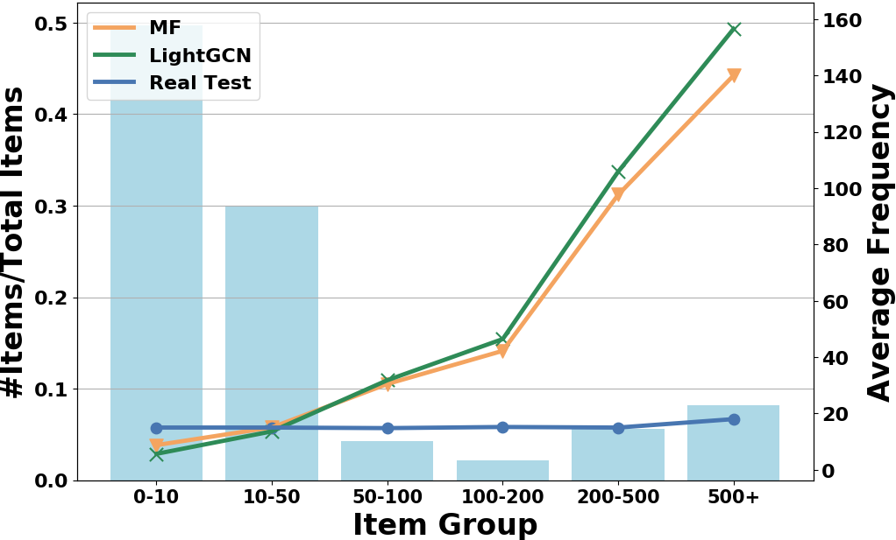

## 消除推荐系统中流行偏见的模型不可知反事实推理

### 摘要

推荐系统的一般目的是向用户提供个性化的建议，而不是建议流行的项目。然而，正常的训练范式，即拟合推荐模型以恢复具有逐点或成对损失的用户行为数据，使模型偏向于流行项目。这导致了可怕的马太效应，使热门商品被更频繁地推荐，甚至变得更受欢迎。现有的工作通过反向倾向加权（IPW）来解决这个问题，它减少了流行项目对训练的影响，并增加了长尾项目的影响。尽管理论上是合理的，但IPW方法对加权策略非常敏感，这是出了名的难以调整。

在这项工作中，我们从一个新颖而基本的视角——因果关系——来探讨流行偏见问题。我们发现，流行度偏差在于项目节点对排名分数的直接影响，因此项目的内在属性是错误地为其分配更高排名分数的原因。为了消除流行偏见，回答一个反事实的问题是至关重要的，即如果模型只使用项目属性，排名分数会是多少。为此，我们制定了一个因果图来描述推荐过程中的重要因果关系。在培训过程中，我们进行多任务学习，以实现每一项事业的贡献；在测试过程中，我们进行反事实推理，以消除项目受欢迎程度的影响。值得注意的是，我们的解决方案修改了推荐的学习过程，该过程对各种模型都是不可知的——它可以很容易地在现有方法中实现。我们在矩阵分解（MF）和LightGCN[20]上进行了演示，这两个模型代表了用于协同过滤的传统和SOTA模型。在五个真实世界数据集上的实验证明了我们方法的有效性。

### CCS概念

• 信息系统→ 推荐系统。

### 关键字

推荐、流行偏见、因果推理

---

参考专栏：

https://blog.csdn.net/u013385018/article/details/126898109

